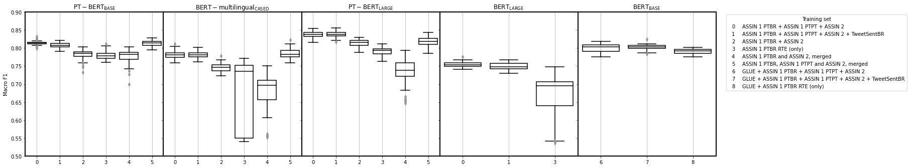
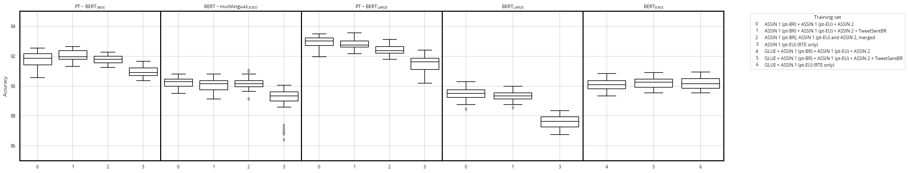
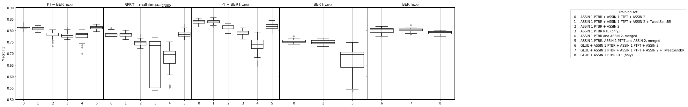
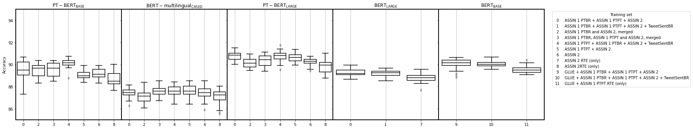
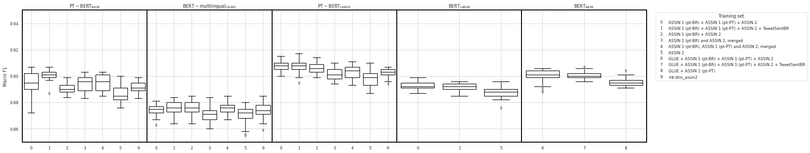
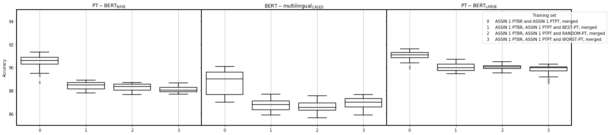
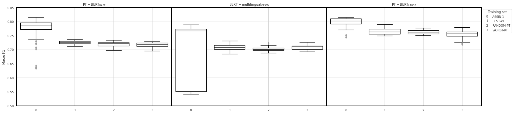

# ASSIN 1 (pt-BR)

## RTE

### Acc

### F1

## STS

### Pearson

### MSE

# ASSIN 1 (pt-PT)

## RTE

### Acc

### F1

## STS

### Pearson

### MSE

# ASSIN 2

## RTE

### Acc

### F1

## STS

### Pearson

### MSE

# TweetSentBR

### Acc

### F1, negative

### F1, neutral

### F1, positive

# Cabezudo et al.

## RTE

### Acc

### F1

