# ASSIN 1 (pt-BR)

## RTE

### Acc

### F1

## STS

### Pearson

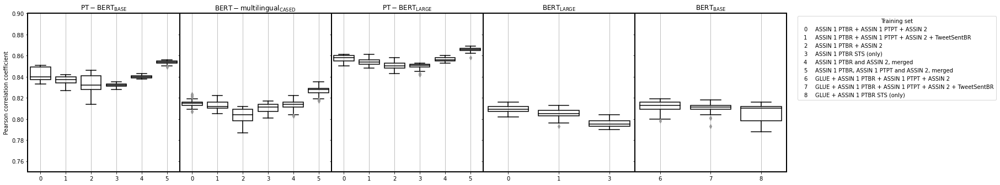

### MSE

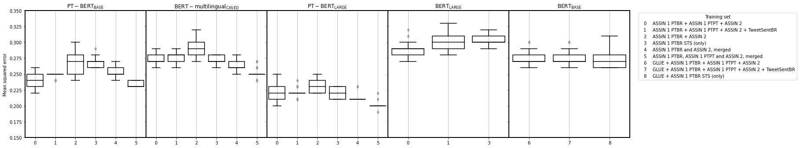

# ASSIN 1 (pt-PT)

## RTE

### Acc

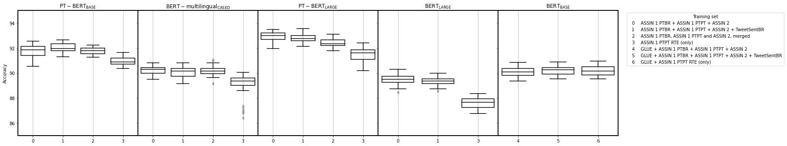

### F1

## STS

### Pearson

### MSE

# ASSIN 2

## RTE

### Acc

### F1

## STS

### Pearson

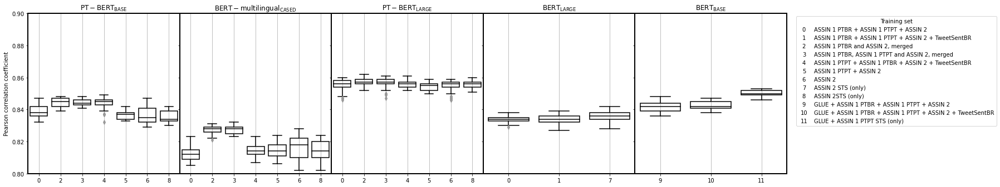

### MSE

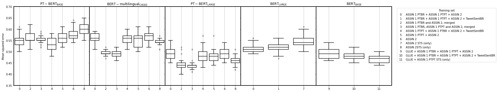

# TweetSentBR

### Acc

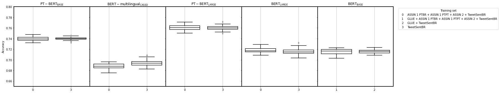

### F1, negative

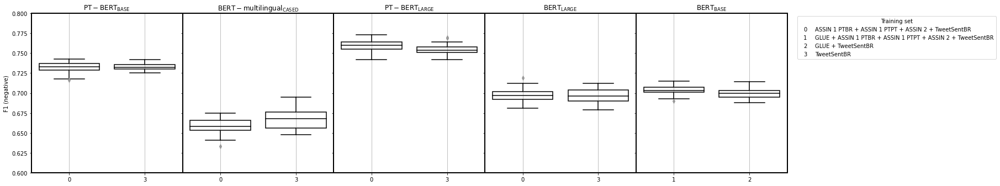

### F1, neutral

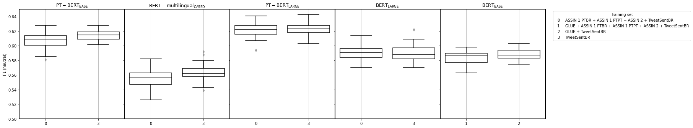

### F1, positive

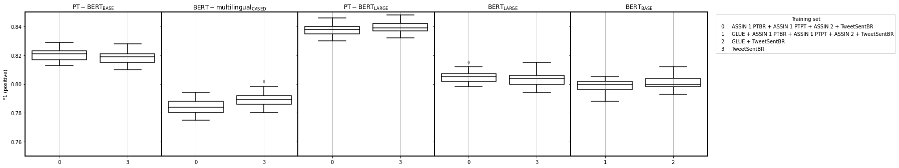

# Cabezudo et al.

## RTE

### Acc

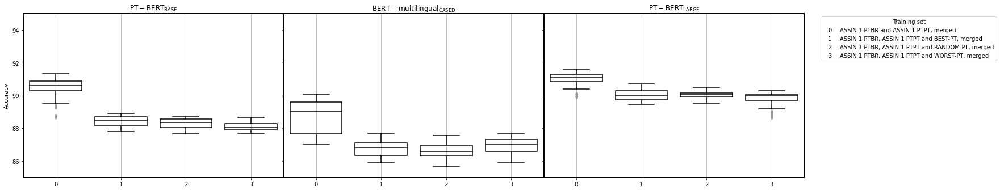

### F1

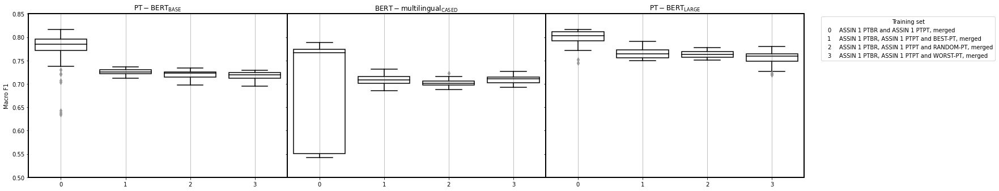
